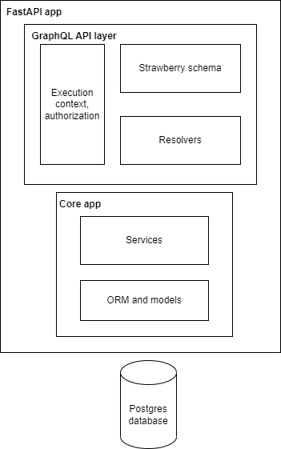

### Task for Valere Margins interview process

App is written in Python, using FastAPI framework and Strawberry for GraphQL API.

This diagram shows a simplefied architecture of the app. App is layered, core app layer contains data definition and a set of services for its manipulation, it does not enforce authorization rather provides it. GraphQL API layer consists of schema definitions and resolvers, resolvers use the services and transform data for the GraphQL layer. Alongside them is the execution context, which provides database session, authenitcation and authorization.

App comes with GraphiQL playground at http://127.0.0.1:8000/graphql, where API documentation can be found and be manually tested. Authentication is done via JWTs, Use 'Authorization' header for authentication with the access token you get from login or register mutations:
{
  "Authorization": "Bearer: <YOUR_JWT_TOKEN>"
}

#### Starting the app

##### Without docker compose

Setup (create virtual environment, install deps)

- python3 -m venv .venv
- source .venv/bin/activate
- pip install -r requirements
- copy and rename .env.example to .env and insert your values

Database can be created and started with Docker:

- docker run --name postgres-margins -e POSTGRES_PASSWORD=postgres -e POSTGRES_DB=Margins -p 5432:5432 -d postgres

Running the app:

- Prerequisites:
  - in venv
  - database started
- uvicorn app.main:app --reload

Running tests

- Prerequisites:
  - in venv
  - database started
- pytest -v

##### With docker compose

- docker compose up --build

Run tests via docker compose:

- docker compose -f docker-compose-test.yml up --abort-on-container-exit --build

#### Would be nice to have

Many features and improvements have been identified during the development process, but due to the time constraint and the main goal of this excercise being appraisal of candidate's ability in software development and his opportunity to learn about GraphQL, they were left out.

- database migrations with **alembic**
- more complete unit and integration tests with **pytest**, along with TDD approach for developing the app
- cleaner **arrange** step in tests
- better error (response) handling in the schema layer
- expiry of email verification tokens
- move authorization layer to the Core app for more granular control (deemed not needed for task)
- don't use GraphQL inputs as arguements for services

#### Notes:

Email verification is functional, however user will still be authorized if he's not verified. This has been done on purpose for easier demonstration, and the step to enable that authorization is trivial.
